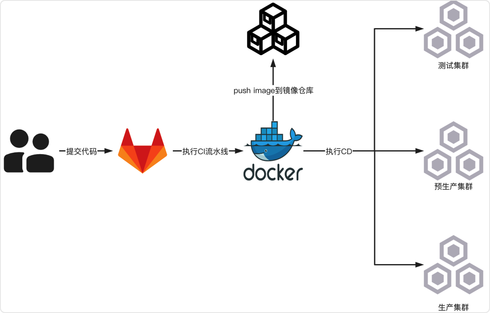

# 项目介绍

简介：基于gitlab ci/cd的脚本项目，能够快速的将项目部署到k8s集群，使用art-template模板引擎进行脚本的维护工作

部署流程：

1. 开发人员提交代码至 gitlab 仓库
2. 根据分支策略触发对应环境的**流水线**（test - 测试，release - 预生产，tag - 生产）执行CICD流程
   1. init：初始化阶段，拉取 k8s 部署应用的 yaml 脚本
   2. test：单测阶段，执行单测
   3. package：打包阶段，执行打包
   4. build：构建阶段：构建应用镜像并上传到 SWR（华为云容器镜像服务，简单讲就是云上的私有镜像仓库，提供镜像的存储和管理功能）
   5. deploy：部署阶段，执行部署脚本部署应用到 k8s 集群

# 项目背景

公司创立初期，很多项目都在从0到1的进行孵化，为了快速的满足研发日常的构建、部署需求，团队提出了临时的、基于 gitlab 的 CI/CD 方案，该方案的实施过程中涉及到了很多的脚本（包括但不限于 .gitlab-ci.yaml、k8s API 对象脚本），为了统一维护这些脚本，我们创建了这个脚本项目，并使用 art-template 模板引擎简化脚本的书写。

# 使用指南

环境要求：本地安装 node 环境

使用：

- 所有的脚本写在 `src` 目录，生成的脚本在 `dist` 目录
- 执行根目录下的 index.js（通过 node index.js），即可将 `src` 的模板语言，编译到 `dist` 中
- 生成的脚本配置到对应的gitlab项目中

gitlab项目脚本配置：

1. 打开 gitlab 到对应工程下面
2. settings -> CI/CD -> General pipelines 找到 Custom CI configuration path
3. 填写脚本工程下 dist 的对应目录（如：`dist/business/demo/ci.yml@devops/cicd-script`）